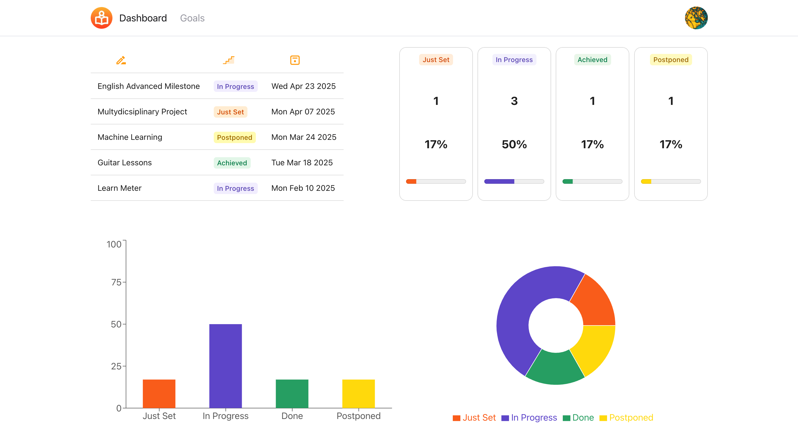
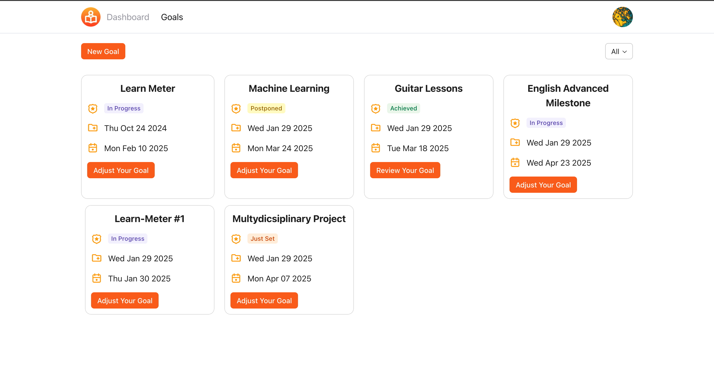
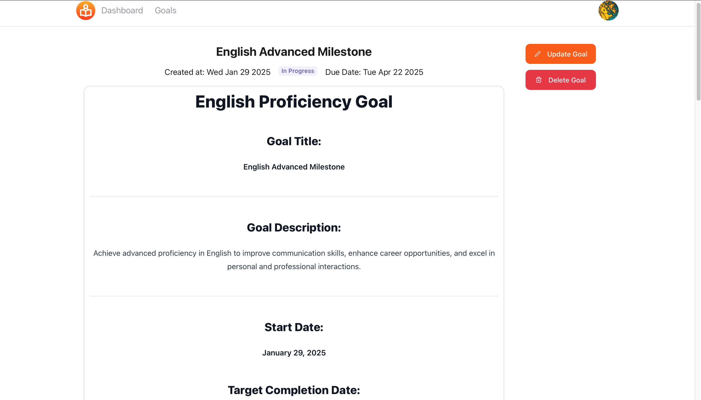
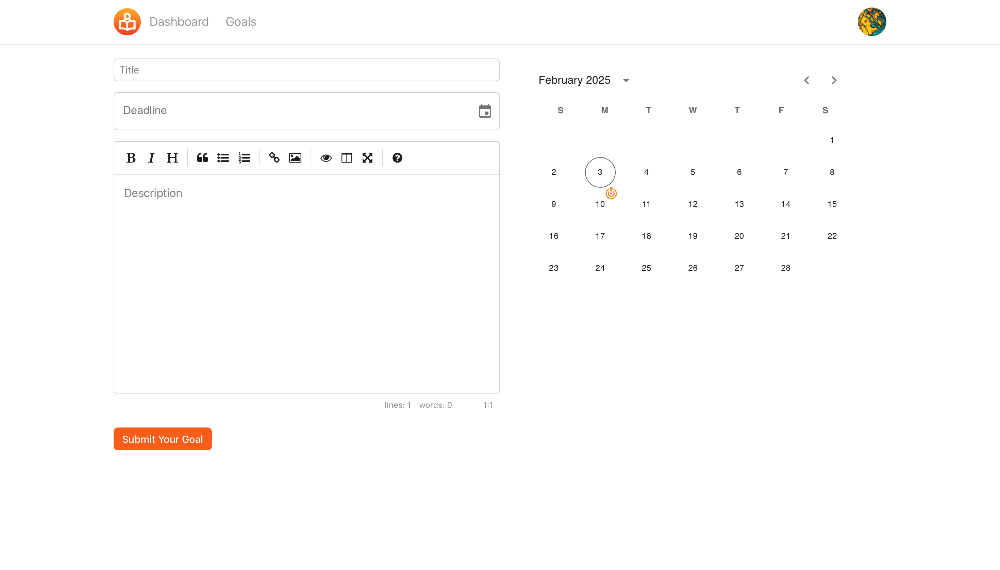
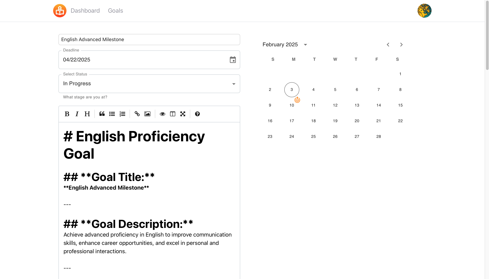

# Learn Meter

**Learn Meter** is a full-stack web application built with Next.js, Prisma, and Tailwind CSS. It is designed to help users efficiently track, organize, and manage their goals. The platform promotes productivity by offering clear visual representations of progress, customizable goal settings, and interactive dashboards.

## Features

- **Dashboard Overview**: Gain insights into your goal progress through summary cards and interactive charts.
- **Goal Management**: Add, edit, and update goals with detailed descriptions, deadlines, and statuses.
- **Visual Progress Tracking**: Interactive bar and pie charts display goal distribution and completion statuses.
- **Status Filtering**: View goals by their current status (e.g., Just Set, In Progress, Achieved, Postponed).

## Technologies Used

- **Frontend**: Next.js, Tailwind CSS, Radix UI, Material UI
- **Backend**: Prisma, NextAuth for authentication
- **Database**: Mysql
- **Charts**: Recharts for visual analytics

  

## Installation

1. Clone the repository:

   ```bash
   git clone https://github.com/your-username/learn-meter.git
   ```

2. Navigate to the project directory:

   ```bash
   cd learn-meter
   ```

3. Install dependencies:

   ```bash
   npm install
   ```

4. Set up the environment variables:

   Create a `.env` file in the root directory and add the necessary environment variables for your database and authentication configurations.

5. Run the development server:

   ```bash
   npm run dev
   ```

6. Open your browser and navigate to `http://localhost:3000`.

## Screenshots

### Dashboard



### Goals Page



### Goal Details



### Create Goal



### Update Goal




## Demo

Visit the application: [Learn Meter](https://learn-meter.vercel.app/)


## License

This project is licensed under the MIT License. See the LICENSE file for details.

## Contact

For questions or feedback, feel free to contact the developer at [ghariamir97@gmail.com](mailto:ghariamir97@gmail.com).
